# Gram Schmidt Orthogonalization - Synthetic data using Simple Linear Regression with factorized weights
## Setup
1. Generate random matrix: $\mathbf{M} \in \mathbb{R}^{m \times d}$
2. Decompose $\mathbf{M}$ into left and right singular matrices 
$$
    \mathbf{U} \mathbf{\Sigma} \mathbf{V}^T := SVD(\mathbf{M})
$$
3. Set eigen-gaps and generate eigen values: $\delta_{\sigma} = \sigma_{i} - \sigma_{i+1}, \mathbf{\Sigma} = diag(\sigma_i)_{i=1}^{r}$
4. Generate $\mathbf{X}, \mathbf{A^\star}, \mathbf{B^\star}, \mathbf{Y}$
    * $\mathbf{X} \in \mathbb{R}^{d \times n}$ generated from random normal distribution and row normalized
    * $\mathbf{A^\star} := \sqrt{\mathbf{\Sigma}}\mathbf{V}_{(r,:)}$, where $\mathbf{A^\star} \in \mathbb{R}^{r \times d}$ and $\mathbf{V}_{(r,:)}$ denotes first ${r}$ rows of $\mathbf{V}$
    * $\mathbf{B^\star} := \mathbf{U}_{(:,r)}\sqrt{\mathbf{\Sigma}}$, where $\mathbf{B^\star} \in \mathbb{R}^{m \times r}$ and $\mathbf{U}_{(:,r)}$ denotes first ${r}$ columns of $\mathbf{U}$
    * $\mathbf{Y} = \mathbf{B^\star}\mathbf{A^\star}\mathbf{X} + z$, where $\mathbf{Y} \in \mathbb{R}^{m \times n}$ and $z$ denotes a random gaussian noise
5. Mean-squared error, Loss function where $\|\cdot\|_F$ denoted frobenius norm
$$
    \mathcal{L} = \frac{1}{2n} \|\mathbf{Y}-\mathbf{B}\mathbf{A}\mathbf{X}\|_F^2
$$
6. Relative error, 
$$
    \delta = \frac{\|\mathbf{W} - \mathbf{W^\star}\|_F}{\|\mathbf{W^\star}\|_F}
$$
7. Gram-Schmidt Orthogonalization, Projection of $a_r$ to be orthogonal to $a_i$ where $i = \{1, 2, \cdots, r-1\}$
$$
    a_r = a_{r} - \frac{a_r \cdot a_i}{a_i \cdot a_i} \cdot a_i
$$

## Experiments
### 1.1 Settings
* Random gaussian noise $z \sim \mathcal{N}(0,0.1)$
* Eigen values: [90, 80, 70, 60, 50, 40, 30, 20, 10, 1]
* Eigen gaps: [10, 10, 10, 10, 10, 10, 10, 10, 9]

  
### 1.2 Results
 

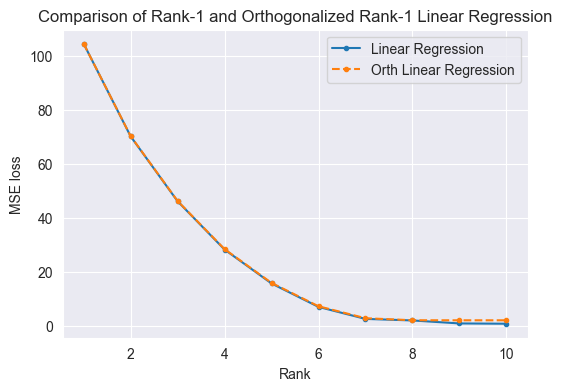
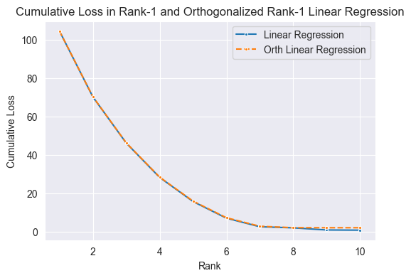
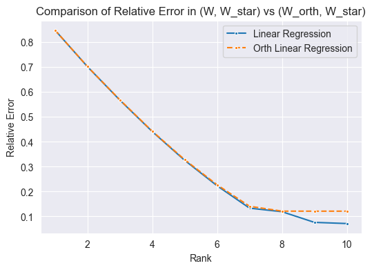
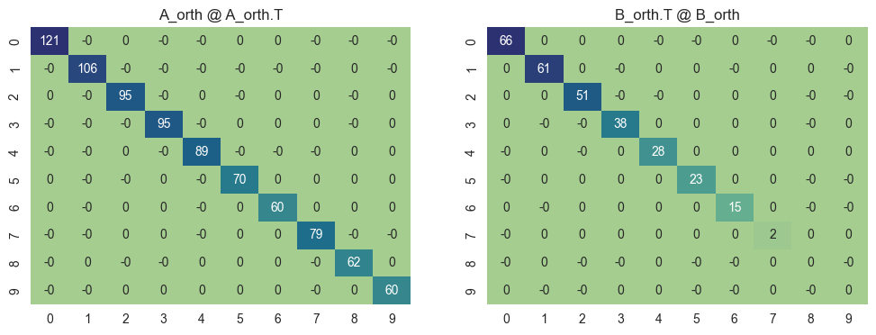
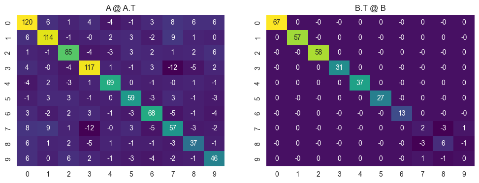

### 1.3 Observations
TBD

---

### 2.1 Settings
* Random gaussian noise $z \sim \mathcal{N}(0,0.1)$
* Eigen values: [10.89, 9.79, 8.7, 7.6, 6.5, 5.4, 4.3, 3.2, 2.1, 1]
* Eigen gaps: [1.1, 1.1, 1.1, 1.1, 1.1, 1.1, 1.1, 1.1, 1.1]


  
### 2.2 Results
 

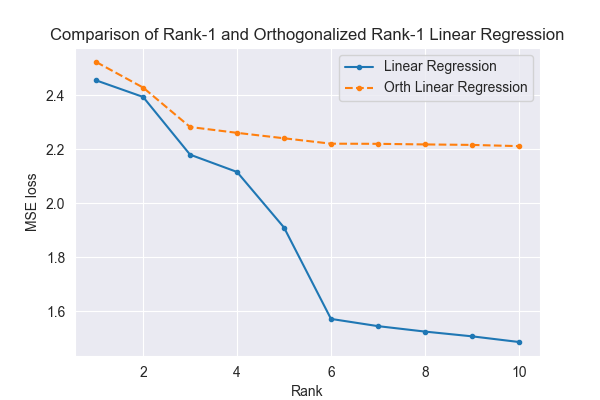
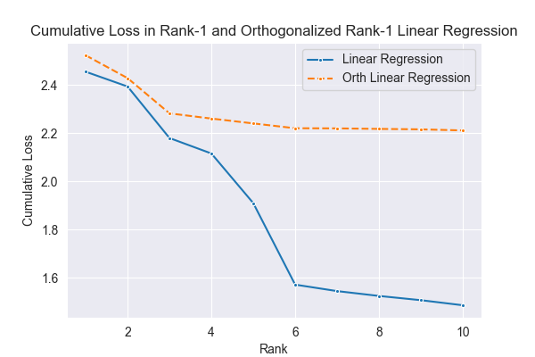
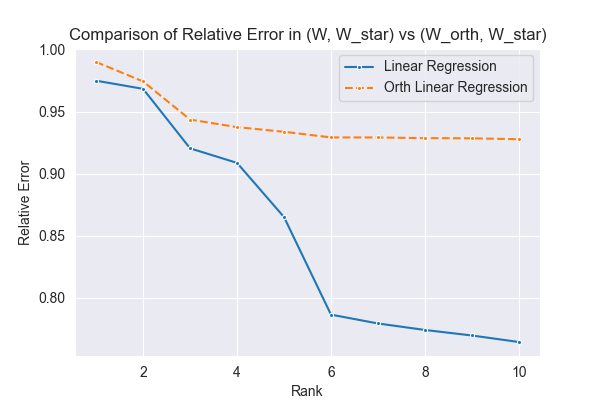
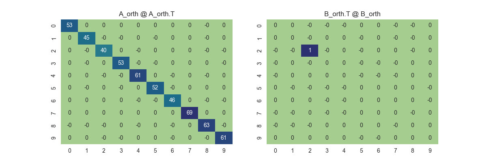
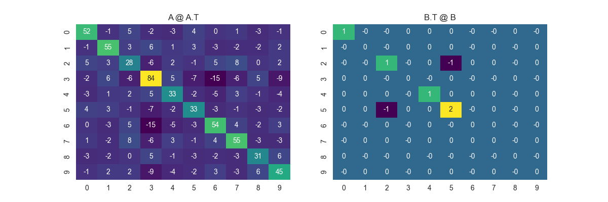

### 2.3 Observations
TBD

# SVD Orthogonalization - MNIST Classification using Neural Network with Factorized Weights
## Setup
1. Training data: Standard MNIST training split
2. Neural Network Architecture,
   - Layer 1: $\mathbf{Z}_1 = ReLU(\mathbf{B}_1\mathbf{A}_1\mathbf{X}^T)$  
   - Layer 2: $\mathbf{Z}_2 = ReLU(\mathbf{B}_2\mathbf{A}_2\mathbf{Z}_1)$
   - Layer 3: $\mathbf{Z}_3 = \mathbf{B}_3\mathbf{A}_3\mathbf{Z}_2$
3. Dimensions, where $r, b$ denote rank and batch size(=64) respectively 
$$
    \mathbf{X} \in \mathbb{R}^{b \times 784} \\
    \mathbf{B}_1 \in \mathbb{R}^{784 \times r}; \mathbf{A}_1 \in \mathbb{R}^{r \times 100} \\
    \mathbf{B}_2 \in \mathbb{R}^{100 \times r}; \mathbf{A}_2 \in \mathbb{R}^{r \times 100} \\
    \mathbf{B}_3 \in \mathbb{R}^{100 \times r}; \mathbf{A}_3 \in \mathbb{R}^{r \times 10} \\
    \mathbf{Z}_3 \in \mathbb{R}^{b \times 10} 
$$
4. Initializations,
$$
    \mathbf{B}_i \sim \mathcal{N}(0,0.01); \mathbf{A}_i \sim \mathcal{N}(0,0.01); 
$$
5. Loss Criterion, Cross-entropy loss
$$
    L = - \sum_{i=1}^{n} y_i \log(\hat{y}_i)
$$
6. Optimizer: **Adam** with $\eta=0.001$ 
7. SVD Orthogonalization with Norm retention,
```python
def orthogonalizeAB_with_norm_retention(A, B):
    # Compute the Frobenius norm of B along dim 0
    norm_B = torch.norm(B, p='fro', dim=0, keepdim=True)
    
    # Compute the Frobenius norm of A along dim 1
    norm_A = torch.norm(A, p='fro', dim=1, keepdim=True)
    
    # Compute the SVD of A and B
    U_B, _, V_B = torch.svd(B)
    U_A, _, V_A = torch.svd(A)
    
    # Orthogonalize matrices A and B
    B_orth = torch.mm(U_B, V_B.T)
    A_orth = torch.mm(U_A, V_A.T)
    
    # Compute the Frobenius norm of the orthogonalized matrices
    norm_B_orth = torch.norm(B_orth, p='fro', dim=0, keepdim=True)
    norm_A_orth = torch.norm(A_orth, p='fro', dim=1, keepdim=True)
    
    # Retain the norms of the original matrices
    B_orth = B_orth * (norm_B / norm_B_orth)
    A_orth = A_orth * (norm_A / norm_A_orth)
    
    # Return the orthogonalized matrices
    return A_orth, B_orth
```

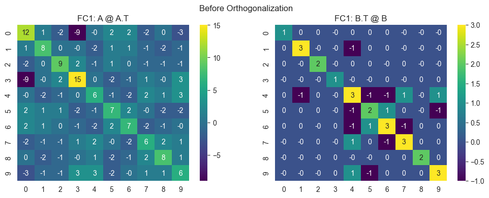
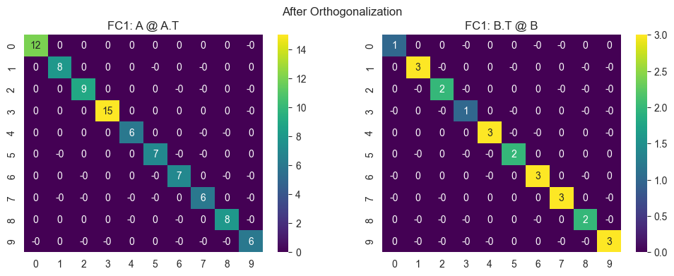

### 1.1 Settings
- rank, r = 10
- epochs = 10
- batch_size, b = 64

### 1.2 Results
| Model                     | Train Acc     | Test Acc      |
| ------------------------- | ------------- | ------------- |
| Without Orthogonalization | 94.148320     | 93.589401     |
| With Orthogonalization    | **95.820922** | **95.254517** |
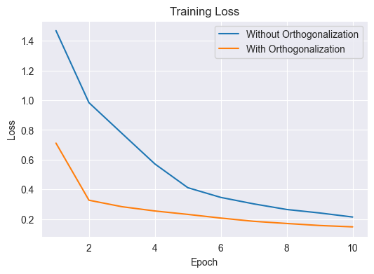

### 2.1 Settings
- rank, r = 5
- epochs = 10
- batch_size, b = 64

### 2.2 Results
| Model                     | Train Acc | Test Acc  |
| ------------------------- | --------- | --------- |
| Without Orthogonalization | 86.630124 | 86.083144 |
| With Orthogonalization    | 90.647143 | 89.936388 |
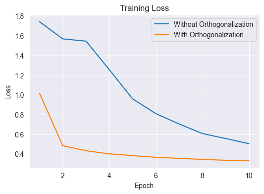